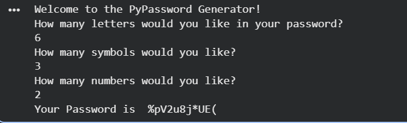

# 🔐 Python Password Generator

A simple command-line Password Generator built using Python.  
This program generates a secure password based on the number of letters, numbers, and symbols chosen by the user.

---

## 📌 Features

- Generate random secure passwords
- User chooses number of:
  - Letters
  - Numbers
  - Symbols
- Password characters are shuffled for better randomness
- Simple command-line interface

---

## 🛠 Technologies Used

- Python
- Random module
- Lists and loops

---

## 🚀 How It Works

1. The user enters:
   - Number of letters
   - Number of symbols
   - Number of numbers
2. The program randomly selects characters.
3. All characters are shuffled.
4. A strong password is generated and displayed.

## 📷 Project Demo

## ⚙️ How It Works

1. The program asks the user how many **letters**, **symbols**, and **numbers** should be included in the password.
2. It randomly selects characters from predefined lists of:
   - Letters (A–Z, a–z)
   - Numbers (0–9)
   - Symbols (!, #, $, %, etc.)
3. All selected characters are stored in a list.
4. The list is shuffled using Python's `random.shuffle()` function to ensure randomness.
5. The characters are then joined together to form the final password.
6. The generated password is displayed to the user.

---

## ▶️ How to Run the Program

1. Install **Python 3** on your computer.
2. Download or clone this repository.

---

## 🎯 Learning Outcomes

This project helped me practice:

- Python programming fundamentals
- Working with lists
- Using loops and user input
- Generating random values using the `random` module
- Basic program structure and logic

---

## 👨‍💻 Author

**Alyx Joy Sarath**  
BTech Computer Science Student  
Interested in Python, Robotics, and Problem Solving.

GitHub: https://github.com/alyxjoysarath

